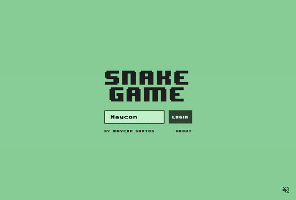
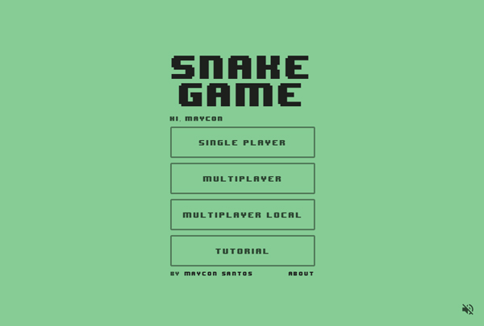
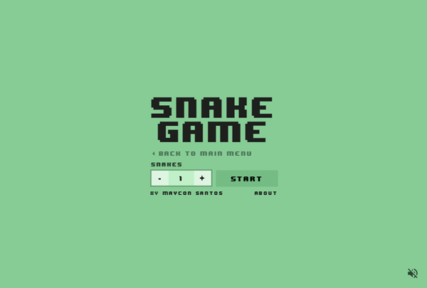
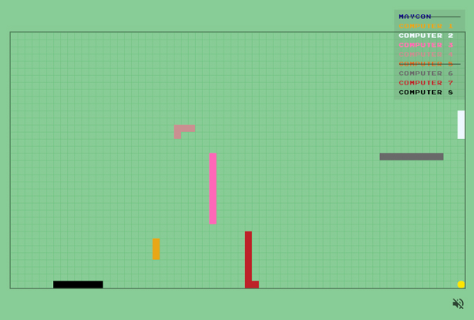

# Snake Game

A simple snake game made with js (For study).

## How to setup and run

### requirements

- Node.js 10.x
- Yarn 1.x

### setup

```sh
yarn build
```


### run

```sh
yarn start
```

## Screens

### The login screen does not need a password. Serves only for identification.


### Choose the color of your snake


### The main menu


### The single player screen

#### You can play with A.I's (Maximum 8).

### The multiplayer player screen

#### Play with your friend and A.I's

### The multiplayer-local screen

#### Play with your friends on the same network (Even those on the cell phone).

### The game running
